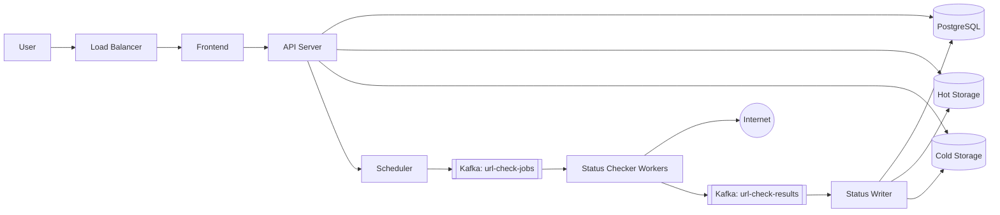

# PulseOps Architecture

## Goal

Build a small uptime monitoring system that lets users create a company, attach URLs to that company, and continuously monitor those URLs. The UI should make the most recent 60 days of history quick to inspect while older data is kept in lower-cost storage.

## Components

## Responsibilities

### Frontend

- Company creation and management.
- URL submission under a company.
- URL search.
- Status dashboard and recent check history.

### API Server

- Owns user-facing CRUD.
- Validates URL ownership and monitor configuration.
- Reads company, URL, and 60-day history data.
- Exposes search endpoints.
- Publishes control-plane events when monitor settings change.

### Scheduler

- Finds active URLs due for probing.
- Emits jobs to Kafka.
- Uses deterministic partition keys so a URL's check jobs remain ordered.
- Advances `next_check_at` only after successfully producing a job.

### Status Checker Workers

- Consume `url-check-jobs`.
- Probe URLs over HTTP.
- Capture status code, latency, DNS/TLS/connect errors, timeout, and checked timestamp.
- Produce immutable results to `url-check-results`.
- Scale horizontally by Kafka consumer group partitions.

### Status Writer

- Consumes `url-check-results`.
- Performs idempotent writes using `check_id`.
- Updates latest URL status.
- Writes detailed history to hot storage.
- Marks records eligible for archive after 60 days.

### Hot Storage

For the first implementation, hot storage is PostgreSQL partitioned tables. This keeps the system simple while meeting the 60-day quick-access requirement. If query volume grows, TimescaleDB or ClickHouse can replace this layer behind the same writer/API contracts.

### Cold Storage

Cold storage is S3-compatible object storage. A retention job exports old partitions to compressed Parquet or NDJSON, validates the export, and then drops or detaches the hot partition.

## Kafka Topics

Kafka is the queue backbone. The two required topics are:

- `pulseops.url-check-jobs.v1`
- `pulseops.url-check-results.v1`

Optional later topics:

- `pulseops.monitor-events.v1`
- `pulseops.archive-requests.v1`
- `pulseops.notifications.v1`

Topic contracts are documented in [Kafka Topics](kafka-topics.md).

## Storage Retention

- `0-60 days`: queryable from hot storage.
- `>60 days`: archived to cold storage.
- Latest status remains in PostgreSQL indefinitely so dashboards do not need to scan history.

## Failure Handling

- Checker failures produce a normal result with `outcome = "error"` when the URL was attempted.
- Kafka consumer retries are bounded; poison messages move to dead-letter topics.
- Status writer is idempotent by `check_id`.
- Scheduler avoids duplicate work by locking due monitors and only advancing schedules after enqueue success.

## Initial Build Order

1. Database schema and API CRUD for companies and URLs.
2. Kafka local infra and topic creation.
3. Scheduler producing check jobs.
4. Checker workers producing check results.
5. Writer consuming results into hot storage.
6. UI for company URLs, latest status, history, and search.
7. Cold archive job for data older than 60 days.

