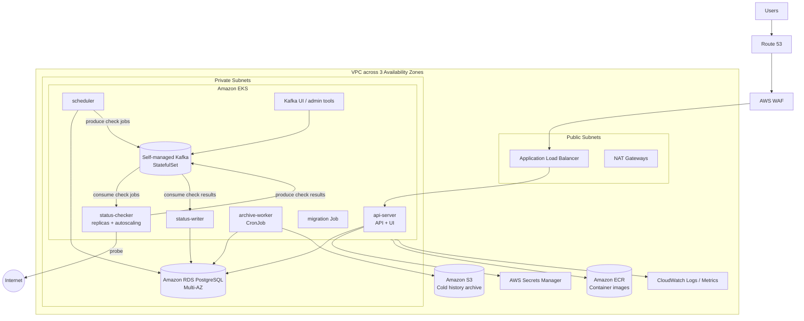
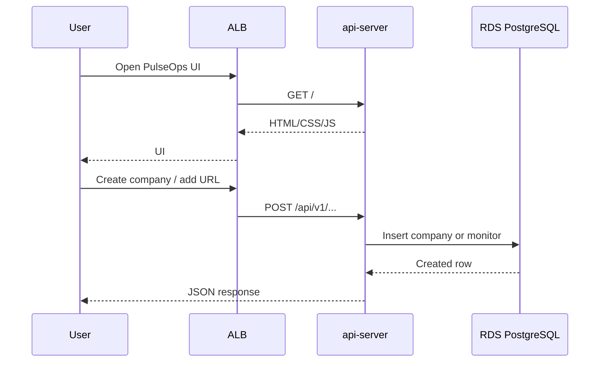
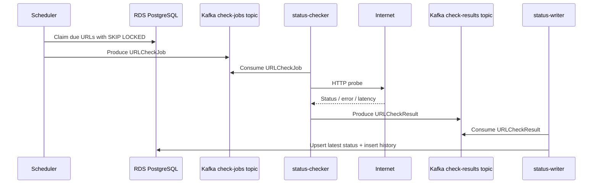
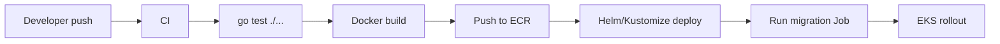

# PulseOps AWS Architecture

This document describes a production-oriented AWS deployment for PulseOps using Amazon EKS as the application runtime.

## Goals

- Run all PulseOps application services on EKS.
- Use EKS for both application services and self-managed Kafka.
- Use managed AWS services for Postgres, object storage, ingress, secrets, and observability.
- Preserve the current service split:
  - `api-server`
  - `scheduler`
  - `status-checker`
  - `status-writer`
- Keep hot probe history fast in Postgres.
- Archive history older than 60 days into S3.

## Architecture Diagram



## AWS Service Mapping

| PulseOps Component | AWS Service |
| --- | --- |
| `api-server` | EKS Deployment behind ALB |
| `scheduler` | EKS Deployment |
| `status-checker` | EKS Deployment with HPA/KEDA |
| `status-writer` | EKS Deployment |
| Local Redpanda | Self-managed Kafka on EKS |
| Local Postgres | Amazon RDS PostgreSQL Multi-AZ |
| Local MinIO | Amazon S3 |
| Docker images | Amazon ECR |
| Local env vars/secrets | AWS Secrets Manager + EKS Pod Identity/IRSA |
| Logs | CloudWatch Logs |
| Metrics | CloudWatch + Amazon Managed Service for Prometheus |
| Dashboards | Amazon Managed Grafana |

## Request Flow



## Probe Pipeline



## Network Design

Use one VPC across three Availability Zones.

Public subnets:

- Application Load Balancer.
- NAT Gateways.

Private subnets:

- EKS worker nodes.
- Amazon RDS PostgreSQL.
- EBS volumes attached to Kafka broker pods.

Recommended VPC endpoints:

- S3 Gateway Endpoint.
- ECR API endpoint.
- ECR Docker endpoint.
- CloudWatch Logs endpoint.
- Secrets Manager endpoint.
- STS endpoint.

Security group rules:

- Internet -> ALB: `443`
- ALB -> `api-server` pods: app port, currently `8081`
- App pods -> RDS: `5432`
- App pods -> Kafka brokers: internal Kafka listener port
- App pods -> S3: through VPC endpoint
- App pods -> Secrets Manager: through VPC endpoint

## EKS Workloads

### `api-server`

- Kubernetes `Deployment`.
- 2+ replicas.
- Exposed by AWS Load Balancer Controller through an ALB Ingress.
- Serves both API and embedded UI.
- Reads/writes companies, monitors, latest status, and history summaries.

### `scheduler`

- Kubernetes `Deployment`.
- Start with 1 replica.
- Can run more than 1 replica because it claims due URLs using database row locks.
- Produces jobs to `pulseops.url-check-jobs.v1`.

### `status-checker`

- Kubernetes `Deployment`.
- Horizontally scalable.
- Consumes from `pulseops.url-check-jobs.v1`.
- Probes URLs over HTTP.
- Produces results to `pulseops.url-check-results.v1`.
- Later optimization: add internal Go worker pool and autoscale by Kafka lag.

### `status-writer`

- Kubernetes `Deployment`.
- 2+ replicas.
- Consumes from `pulseops.url-check-results.v1`.
- Writes idempotently using `check_id`.
- Updates latest status and inserts hot history rows.

### `archive-worker`

- Kubernetes `CronJob`.
- Runs daily or hourly.
- Exports history older than 60 days from Postgres.
- Writes compressed files to S3.
- Records archive manifests.
- Drops or detaches old hot partitions after export verification.

### `migration`

- Kubernetes `Job`.
- Runs database migrations before app rollout.
- Should eventually replace raw `db/schema.sql` with a migration tool.

## Self-Managed Kafka on EKS

Run Kafka as a self-managed EKS workload.

Recommended deployment:

- Use Strimzi Kafka Operator or Bitnami Kafka Helm chart.
- Prefer Strimzi for production because it gives Kafka-native CRDs, rolling updates, listener management, and topic/user operators.
- Run Kafka in KRaft mode unless there is a specific need for ZooKeeper.
- Use a dedicated EKS managed node group for Kafka.
- Spread brokers across 3 Availability Zones.
- Use EBS `gp3` PersistentVolumes for broker storage.
- Use Kubernetes `StatefulSet` semantics through the Kafka operator.
- Expose Kafka only inside the VPC/EKS cluster unless there is a strong external-client requirement.

Topics:

- `pulseops.url-check-jobs.v1`
- `pulseops.url-check-results.v1`
- `pulseops.url-check-jobs.dlq.v1`
- `pulseops.url-check-results.dlq.v1`

Production recommendations:

- Use private subnets and internal Kubernetes Services.
- Use TLS in transit.
- Use SASL/SCRAM or mTLS for clients.
- Set topic partitions based on expected probe volume.
- Autoscale `status-checker` by consumer lag.
- Keep result topic retention long enough for replay/debugging, but not as the system of record.
- Set replication factor to 3 for production topics.
- Set `min.insync.replicas` to 2 for production topics.
- Use PodDisruptionBudgets so voluntary disruptions do not take down quorum.
- Use topology spread constraints so brokers land across AZs.
- Monitor broker disk usage aggressively; Kafka failure modes often start with full disks.

Kafka EKS resources:

- Kafka operator namespace, for example `kafka-system`.
- Kafka cluster namespace, for example `pulseops`.
- 3 broker pods minimum.
- Dedicated storage class for Kafka broker EBS volumes.
- Internal bootstrap service, for example `pulseops-kafka-bootstrap:9092`.
- Topic definitions managed as Kubernetes custom resources if using Strimzi.

Operational responsibilities:

- Broker upgrades.
- Partition reassignment.
- Disk expansion.
- Backup/restore strategy if required.
- Certificate/user rotation.
- Broker and consumer-lag monitoring.
- Capacity planning for partitions, retention, and disk.

## Database on AWS

Use Amazon RDS PostgreSQL Multi-AZ.

Tables:

- `companies`
- `monitored_urls`
- `url_latest_status`
- `url_check_history`
- `archive_manifests`

Production recommendations:

- Enable Multi-AZ.
- Enable automated backups.
- Enable Performance Insights.
- Use private subnets only.
- Use Secrets Manager for credentials.
- Add partitioning for `url_check_history` before high-volume production use.
- Add read replica only if API read load needs it.

## Cold Storage

Use Amazon S3 for archived probe history.

Suggested key layout:

```text
s3://pulseops-history-prod/company_id=<company_id>/date=YYYY-MM-DD/part-000.ndjson.gz
```

Lifecycle:

- Keep fresh archive files in S3 Standard or Standard-IA.
- Transition older archives to Glacier Instant Retrieval or Glacier Flexible Retrieval based on access needs.
- Expire objects only if business retention allows it.

## Secrets and IAM

Use EKS Pod Identity or IRSA so pods do not need static AWS keys.

Secrets:

- RDS credentials.
- Kafka SASL/TLS credentials.
- Any future notification provider credentials.

IAM access:

- `api-server`: read app secrets.
- `scheduler`: read app secrets, produce to check jobs topic.
- `status-checker`: consume check jobs, produce check results.
- `status-writer`: consume check results, write to RDS.
- `archive-worker`: read/write archive S3 bucket, write archive manifests.

## Observability

Minimum production signals:

- API request rate, latency, error rate.
- Scheduler jobs produced per tick.
- Kafka consumer lag per consumer group.
- Checker probe latency and error type counts.
- Writer insert/upsert failures.
- RDS CPU, connections, locks, slow queries.
- Kafka broker health, ISR shrink events, under-replicated partitions, disk usage, and topic throughput.
- EKS pod restarts and pending pods.

Recommended stack:

- CloudWatch Container Insights.
- CloudWatch Logs for pod logs.
- Amazon Managed Service for Prometheus.
- Amazon Managed Grafana.
- OpenTelemetry collector in EKS later.

## Deployment Flow



## Initial Terraform Modules

Build Terraform in this order:

1. VPC with public/private subnets across 3 AZs.
2. ECR repositories.
3. EKS cluster and managed node groups.
4. Dedicated EKS managed node group for Kafka.
5. AWS Load Balancer Controller.
6. RDS PostgreSQL Multi-AZ.
7. S3 archive bucket and lifecycle rules.
8. Secrets Manager secrets.
9. IAM roles for service accounts / EKS Pod Identity.
10. Observability add-ons.
11. Kafka operator and Kafka cluster manifests.

## Initial Kubernetes Manifests

Use Helm or Kustomize for:

- `api-server` Deployment, Service, Ingress.
- `scheduler` Deployment.
- `status-checker` Deployment.
- `status-writer` Deployment.
- `archive-worker` CronJob.
- `migration` Job.
- Kafka operator manifests or Helm release.
- Kafka cluster custom resource / StatefulSet.
- Kafka topic resources.
- ConfigMaps for non-secret settings.
- Secrets Manager integration for secret settings.
- PodDisruptionBudgets.
- HorizontalPodAutoscalers.

## Recommended First Production Cut

Start modest:

- EKS managed node group across 3 AZs.
- Dedicated Kafka node group across 3 AZs.
- `api-server`: 2 replicas.
- `scheduler`: 1 replica.
- `status-checker`: 3 replicas.
- `status-writer`: 2 replicas.
- RDS PostgreSQL Multi-AZ.
- Self-managed Kafka with 3 brokers across 3 AZs.
- S3 archive bucket.
- ALB ingress with ACM TLS certificate.

Then add:

- KEDA autoscaling for Kafka lag.
- Postgres partitioning migration.
- Archive worker implementation.
- CI/CD deployment automation.
